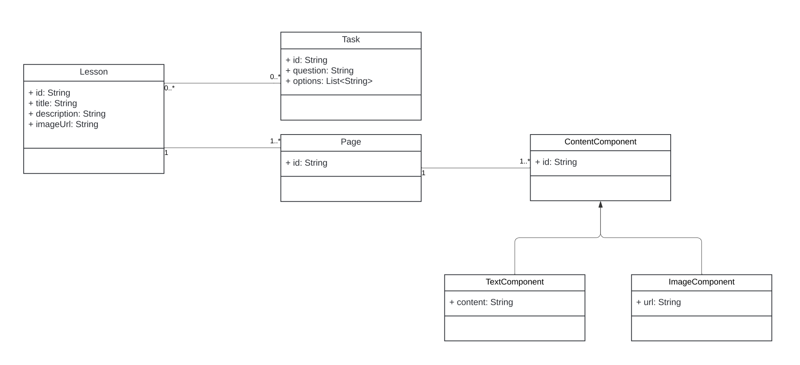

# Lesson Challenge

The app loads Lessons each containing Pages and Tasks. Here is the data model:

## Task

Implement detailed view of the Lesson.

Lesson details feature presents a screen that allows viewing and interacting
with Pages and Tasks of a selected Lesson.

## Expected Criteria:

- The screen allows to move between Pages of the Lesson

- Each Page displays its content (list of `ContentComponent`) including text and
  image components

- After user saw all Pages the screen presents Tasks of the Lesson in a single
  list view

- At any moment the user is able to move freely between the Pages and the Tasks
  view

## Out of scope

- The ability to interact with the Tasks (submitting answers, etc.)

Screen entry point widget: `LessonDetailsPage`.
Use existing bloc that loads the lesson data by id `LessonDetailsBloc`.
